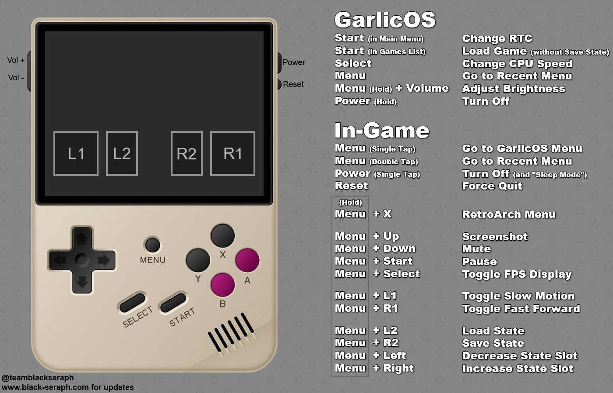

# Anbernic RG35XX
RG35XX handheld console config, and info.  
- [Official RG35XX Web](https://anbernic.com/products/rg35xx?sca_ref=2121940.nMT2peSQIR)
- [Anbernic RG35XX starter guide](https://retrogamecorps.com/2023/01/03/anbernic-rg35xx-starter-guide/)

## Official firmware
 - [Official Firmware download page](https://win.anbernic.com/download/270.html)
   - [RG35XX Dual System Firmware, Official + Garlic OS, includes SD card content 64GB and 128GB](https://drive.google.com/drive/folders/1tJOUt3hW6VwbqgsCRb96TMQz6yRA2GAn?usp=sharing)
   - [RG35XX-EN-64-221223, Official](https://drive.google.com/drive/folders/1HfGCxkratM_zYiYfGWCrHZ1AynO3hIwU?usp=share_link)
   - [RG35XX 20221212 EN](https://drive.google.com/drive/folders/19gmd_0c9qQl4ttTeaYjT3qjeDawallO9?usp=sharing)

## Custom firmware
 - [GarlicOS](https://www.patreon.com/posts/76561333)
 - [Koriki](https://github.com/rg35xx-cfw/Koriki)
 - [Batocera](https://github.com/rg35xx-cfw/rg35xx-cfw.github.io)

## Skraper
Folder [Skraper](./Skraper/) contains config for [Image Skraper software](https://www.skraper.net/) building nice images of installed ROMs.  
Config [skraper.config.json](./Skraper/skraper.config.json) is config for Skraper with removed username and password, contains all systems available on RG35XX GarlicOS.  
Currently only one Image MIX is available [RG5XX-GarlicOS-Mix](./Skraper/RG5XX-GarlicOS-Mix/) for GarlicOS on RG35XX

## GarlicOS
Quick guide to Garlic OS

### Additional GarlicOS tips
- The battery indicator on this device is not accurate, due to some voltage reading issues with the hardware. You should expect about 3-4 hours of battery life altogether, even if the indicator started otherwise.
- While in a game, tap the MENU button to return to the GarlicOS menu. It will save your progress when you exit the game. If tapping the MENU button doesn’t work, try double-tapping the button, that will usually do the trick.
- While in a game, tap the POWER button to put the device to sleep. Hold the POWER button for three seconds to awaken the device, it will resume your progress in the game. To power down the device altogether, hold the POWER button for three seconds when in the main GarlicOS menu.
- To reduce clutter, you can consolidate games into the same folder if they share the same emulator core. For example, you can add Genesis, Sega CD, and 32x games to the “MD” folder and they will al show up under the same folder and launch properly. The same could be done with GB/GBC, PCE/PCECD, CPS/FBNeo, and more.
Here are some hotkeys to remember:

MENU + X = RetroArch quick menu  
MENU + R2 = save state  
MENU + L2 = load state  
MENU + R1 = fast forward (toggle)  
MENU + L1 = slow motion  
MENU + Volume UP = increase screen brightness  
MENU + Volume DOWN = reduce screen brightness  

GarlicOS has some neat features under the hood, including custom scaling, and so you really don’t need to do much within RetroArch to adjust the settings. These will likely improve with every new release, too. However, if you’d like to tinker a bit, here are some tips to get you on your way:

- While in a game, hold the MENU button and press X to enter the RetroArch quick menu. Note that due to the way this version of RetroArch behaves, in order to make permanent changes you will need to open up RA via the RA icon within the main GarlicOS menu.
  - Inside the Core Options section you can make adjustments like removing the sprite limit on certain systems, or setting colorization options for systems like Game Boy and Game Boy Color. Note that while playing Game Boy games you can also toggle between the colorization options by pressing the L2 and R2 buttons.
  - Inside Settings > Video > Scaling you can toggle the “Keep Aspect Ratio” setting in case you want to see a different aspect ratio on your game. If you find a setting that works particularly well with the system you are playing, go to Quick Menu > Overrides > Save Content Directory Overrides to apply this setting to all games within that same folder. This works well with the GB, GBC, and GBA systems, since by default GarlicOS scales them to the native 4:3 aspect ratio of the display instead of the original system aspect ratio.
